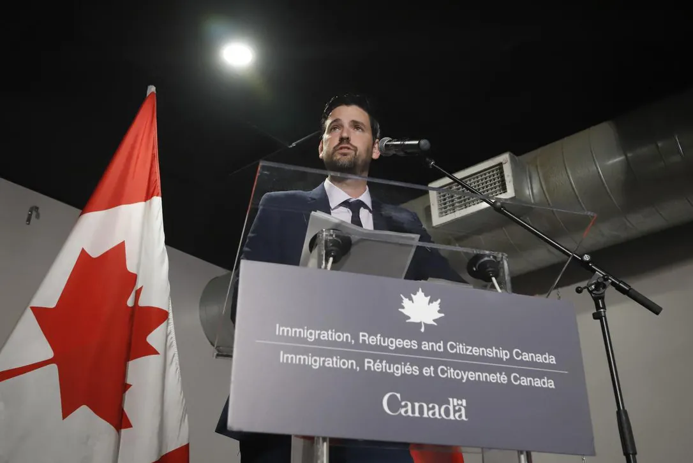

On Friday, a new immigration measure was announced in Canada that would allow international graduates with expired or expiring work permits to extend their work authorization for an additional 18 months. Postgraduate work permit (PGWP) holders who qualify for the program will be contacted with information about how to opt in and update their file starting April 6. This is a similar policy to what was implemented twice during the pandemic to allow international graduates to stay and work in Canada due to significant immigration backlogs.

Those with expired work permits in 2022 and 2023 will be able to restore their status, even if they are beyond the 90-day restoration period, and will receive an interim work authorization while awaiting processing of their new work permit application. The aim of this program is to support employers in hiring the workers they need to grow and to keep talented individuals in Canada to meet the long-term needs of the economy.

However, there have been flaws in the past with permit holders not receiving the needed documents and running out of status to legally stay and work in the country. As a result, lessons learned from that process have been applied to implement a similar policy.

International students and graduates have become a main source of temporary migrant workers in Canada, with more than 286,000 international graduates in Canada at the end of 2022. There were 807,750 international students in Canada at all levels of study last year, up 43% from five years ago. Indian students accounted for 40% of the overall international enrolment, followed by Chinese students, at 12%.

Advocates have called for the PGWP to be permanently renewable to better protect vulnerable students from abuse and exploitation. They have also urged for the Canadian Experience Class program to be resumed, which most international graduates use to transition to permanent residence based on their work experience and education credentials acquired in the country.
