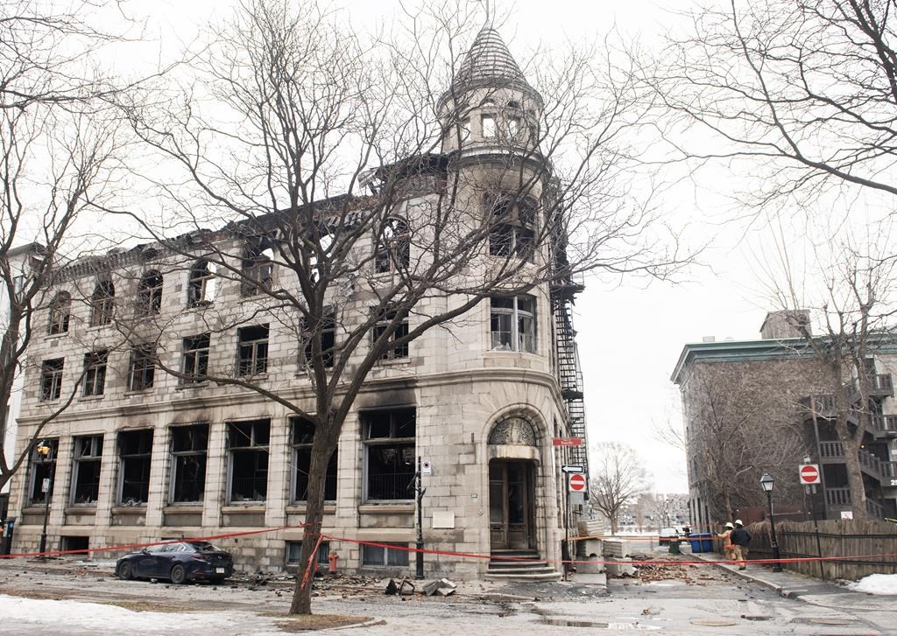

A fire that tore through a historic building in Montreal's Old Port district on Thursday has left at least seven people missing, according to local fire officials. Initially, only one person was believed to be missing, but updated information from various sources suggested there may be victims inside the debris. Nine people were injured in the blaze, including two with serious burns who remain in hospital.

Montreal fire operations chief Martin Guilbault announced on Saturday that the building would be slowly taken down beginning on Sunday morning to ensure the safety of emergency responders. A parameter has been set up around the site, and part of the street has been blocked off. The cause of the fire remains unknown, and investigators from the Montreal police arson squad are leading the investigation.

The building, which housed an architectural firm and residences, was also the site of several Airbnb rentals. Montreal city officials have been cracking down on Airbnb rentals in the area, but it is not yet known if any of the missing individuals were tourists staying in a short-term rental.

A memorial of flowers was set up in front of the building where people stopped to pay their respects. The fire is a tragic reminder of the importance of fire safety and the devastating consequences of such incidents. The investigation is ongoing, and officials are urging the public to come forward with any information that may help in the search for the missing individuals.

