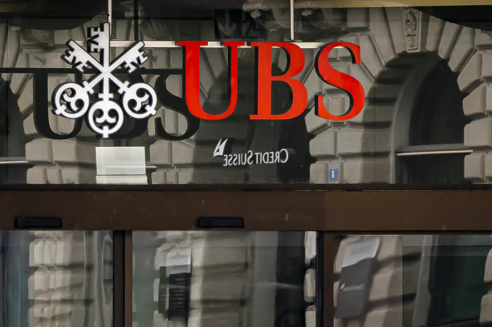

After a highly volatile week for Credit Suisse, banking giant UBS has announced its purchase of the smaller rival in an effort to avoid further market-shaking turmoil in global banking. The deal, announced by Swiss President Alain Berset on Sunday night, is being hailed as a move of great breadth for the stability of international finance.

Credit Suisse is designated by the Financial Stability Board as one of the world’s globally systemic important banks, meaning that regulators believe its uncontrolled failure would lead to ripples throughout the financial system not unlike the collapse of Lehman Brothers 15 years ago. As such, the collapse of Credit Suisse would lead to incalculable consequences for the country and the international financial system, according to Berset.

Many of Credit Suisse’s problems are unique and do not overlap with the weaknesses that brought down other banks, such as Silicon Valley Bank and Signature Bank. As a result, their downfall does not necessarily signal the start of a financial crisis similar to what occurred in 2008. However, global financial markets have been on edge since Credit Suisse’s share price began plummeting this week.

The 167-year-old Credit Suisse has already received a $50 billion loan from the Swiss National Bank, which briefly caused a rally in the bank’s stock price. Yet the move did not appear to be enough to stem an outflow of deposits, according to news reports. Its current troubles began after Credit Suisse reported on Tuesday that managers had identified “material weaknesses” in the bank’s internal controls on financial reporting as of the end of last year. That fanned fears that Credit Suisse would be the next domino to fall.

The deal with UBS comes after Credit Suisse shares plunged to a record low after its largest investor, the Saudi National Bank, said it wouldn’t invest any more money into the bank to avoid tripping regulations that would kick in if its stake rose about 10%. On Friday, Credit Suisse shares dropped 8% to close at 1.86 francs ($2) on the Swiss exchange. The stock has seen a long downward slide: It traded at more than 80 francs in 2007.

While smaller than its Swiss rival UBS, Credit Suisse is considered a globally systemically important bank. The firm has significant trading desks around the world, caters to the rich and wealthy through its wealth management business, and is a major advisor for global companies in mergers and acquisitions. Notably, Credit Suisse did not need government assistance in 2008 during the financial crisis, while UBS did.

The Swiss bank has been pushing to raise money from investors and roll out a new strategy to overcome an array of troubles, including bad bets on hedge funds, repeated shake-ups of its top management, and a spying scandal involving UBS. Despite the banking turmoil, the European Central Bank on Thursday approved a large, half-percentage point increase in interest rates to try to curb stubbornly high inflation, saying Europe’s banking sector is “resilient,” with strong finances. ECB President Christine Lagarde said the banks “are in a completely different position from 2008” during the financial crisis, partly because of stricter government regulation.

