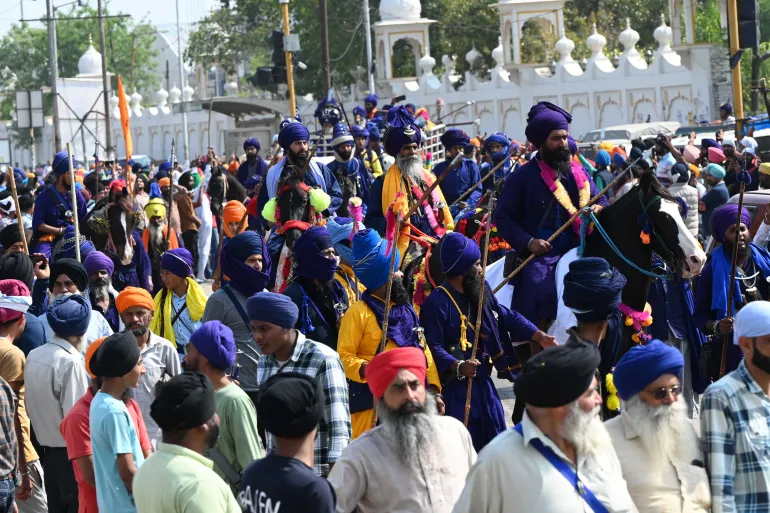

The hunt for Amritpal Singh, a hardline Sikh preacher who has been advocating for the creation of Khalistan, a separate Sikh homeland, has led to a state-wide internet shutdown in Punjab and the arrest of over 100 of his supporters. Singh had gained prominence for his radical interpretation of Sikhism and his vocal demands for the establishment of Khalistan. His followers, who were armed with weapons, recently raided a police station on the outskirts of Amritsar, causing several injuries.

In response to these actions, the Punjab police have intensified their efforts to apprehend Singh and his supporters. The police have arrested over 100 people so far, including Singh's uncle and driver. They have also extended the ban on mobile internet and SMS services across Punjab to prevent the spread of misinformation and rumours.

The situation has become so serious that Indian authorities summoned the UK diplomat in New Delhi to protest against the actions of Singh's supporters, who allegedly entered and vandalised the Indian High Commission in London. India has demanded that the suspects be identified, arrested, and prosecuted, and has asked for an explanation for the security lapse that allowed them to enter the official premises.

This incident has once again highlighted the issue of Sikh separatism, which has been a major challenge for India for several decades. Punjab witnessed a violent separatist movement for Khalistan in the 1980s and early 90s, resulting in the deaths of thousands of people. India has accused Sikh hardliners of trying to revive the movement with massive financial support.

The situation remains tense in Punjab, with a significant police presence in rural areas and around Singh's village of Jallupur Khera. The police have described the situation as "under control", but citizens have been urged not to believe in rumours. The manhunt for Singh and his followers is ongoing, and it remains to be seen whether the authorities will be able to apprehend them and restore peace to the region.

