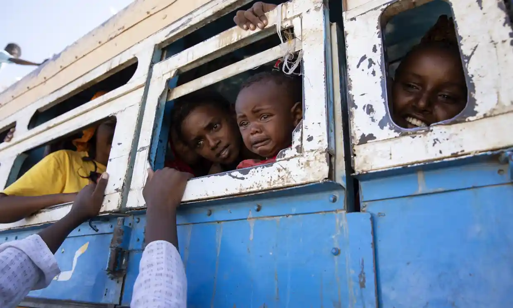

Secretary of State Antony Blinken has announced that the United States has concluded that both Ethiopian and Eritrean troops, as well as rebels, committed war crimes during the brutal two-year conflict in Tigray. Blinken made the statement after visiting Addis Ababa, where he had previously sounded upbeat about the prospects for peace following an accord in November 2022. However, his return to Washington saw him make a forceful call for accountability.

Blinken stated that the state department had carried out a “careful review of the law and the facts” and had concluded that “war crimes” were committed by federal troops from both Ethiopia and Eritrea, as well as by the rebel Tigray People’s Liberation Front (TPLF) and forces from the neighbouring Amhara region. Furthermore, the state department found “crimes against humanity” committed by Ethiopian, Eritrean and Amhara forces, including killings and sexual violence, though Blinken did not mention the TPLF.

The conflict in Tigray has been devastating, with an estimated 500,000 people having died, making it one of the deadliest wars of the 21st century. The TPLF, once the major powerbroker in Ethiopia, attacked military installations in the region in November 2020, triggering a major counteroffensive.

Blinken called for the Ethiopian and Eritrean governments, as well as the TPLF, to hold those responsible for the atrocities accountable. He also spoke about accountability during his trip to Addis Ababa, where he held an unusually long meeting with Prime Minister Abiy Ahmed and spoke separately with senior TPLF leader Getachew Reda.

However, Blinken did not directly mention war crimes or crimes against humanity while in Addis Ababa, and Abiy had previously voiced anger when Blinken spoke more generally about crimes against humanity during the war. Abiy has also rejected UN-led efforts for a probe.

The conduct of the war has badly soured US relations with Ethiopia, Africa’s second most populous nation and long one of Washington’s major partners on the continent. Abiy, once hailed as part of a new generation of forward-leaning leaders and winner of the Nobel Peace prize for his reconciliation with Eritrea, has also faced criticism for his handling of the conflict.

Senator Jim Risch, the top Republican on the Senate Foreign Relations Committee, has criticized the Biden administration’s response, stating that Blinken’s finding was belated and that more action should have been taken to hold perpetrators accountable. The administration has imposed sanctions on Eritrea and removed Ethiopia from a major trade pact but has held back on further actions against the warring parties.

