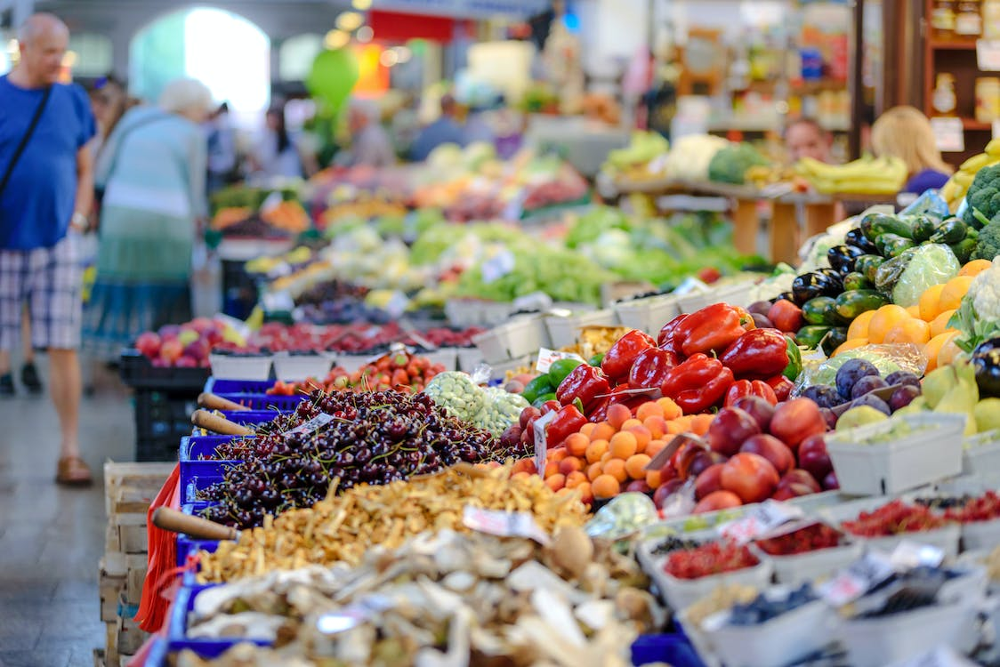

The food inflation rate in Canada appears to be easing, but experts warn that shoppers shouldn't expect lower prices at the grocery store. Statistics Canada reported that the cost of groceries in February 2022 rose by 10.6% compared to the same period last year, which is a decrease from January's year-over-year increase of 11.4%. However, it doesn't mean that the price of food is coming down; it means that prices are rising less quickly. This signals that the worst of the grocery price hikes could be over.

The director of the Agri-Food Analytics Lab at Dalhousie University, Sylvain Charlebois, said that consumers may still feel sticker shock at the grocery store as the products they buy are up closer to 15% or 20%. Last month, multiple pantry staples increased by nearly double the overall inflation rate for food purchased from stores. Pasta prices rose by 23.1%, flour jumped 22.9%, and butter increased by 19.7%, according to Statistics Canada.

Fraser Johnson, a professor of operations management at Ivey Business School, said that he expects a "steady progression to more normalized price increases" by the end of the year. However, high costs for delivery, packing, and labor, coupled with historically high commodity prices, are still contributing to rising grocery bills. Johnson also noted that it takes time for contracts and pricing to work their way through the system.

Meanwhile, food purchased from restaurants rose by 7.7% in February compared to the same period last year, which is down from January's 8.2% price growth. People are being more careful with their budget these days, and restaurant operators are being very prudent with menu prices, according to Charlebois.

