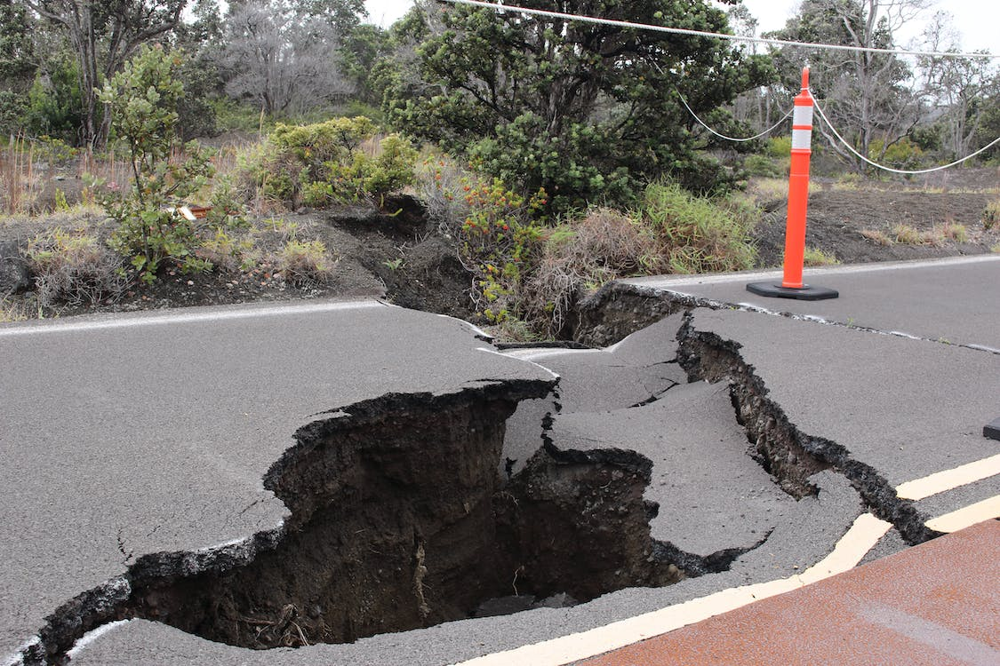

A strong earthquake with a magnitude of 6.5 struck Pakistan and Afghanistan on Tuesday, causing widespread panic and leaving at least nine people dead. The quake was centred in Afghanistan's mountainous Hindukush region, bordering Pakistan and Tajikistan, and was felt as far away as Islamabad, the capital of Pakistan, and Kabul, the capital of Afghanistan. Dozens of people were injured, and many were brought to hospitals in a state of shock.

The tremors caused roofs to collapse in various parts of northwestern Pakistan, and at least 19 mudbrick homes were reported to have collapsed in remote areas. Dozens more were damaged. The quake also triggered cracks in some apartment buildings in Islamabad, according to media reports. People were seen standing outside their homes and offices in Peshawar, the capital of Khyber Pakhtunkhwa province on the border with Afghanistan.

The region is prone to violent seismic activity, with a magnitude 7.6 quake in 2005 killing thousands of people in Pakistan and Kashmir. Last year, a 6.1 magnitude quake in southeastern Afghanistan claimed the lives of over 1,000 people, according to the Taliban government. The UN offered a lower estimate of 770.

Pakistani Prime Minister Shahbaz Sharif called on disaster management officials to remain vigilant to handle any situation, while the Taliban government in Afghanistan ordered all health centres to be on standby.

