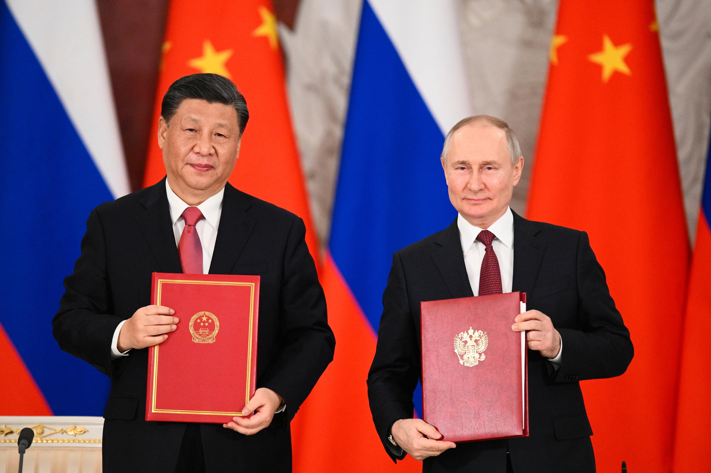

As Presidents Xi Jinping and Vladimir Putin embrace in Moscow this week, Pentagon strategists are wondering if it's time to rethink their traditional division of the world into East and West. The U.S. has always maintained regional forces under European Command or Indo-Pacific Command, but the growing bond between China and Russia suggests a need for a more integrated approach. In fact, some experts are now advocating for a single "Eurasian Command" to handle the evolving threat from these two powerful nations.

The headline of the week may be the showy meetings between Xi and Putin, but the real story is China's support for a weakened Russia. While China is not yet providing weapons to Russia, Xi's moral and psychological backing is a significant boost for a nation that has suffered from sanctions and isolation. As the West continues to turn away from Putin's aggression, China is stepping in to fill the void.

The paradox of the Ukraine war is that Putin's bid for greater power in Europe has made him weaker. Russia has lost energy markets in Europe because of its reckless invasion, so it will increasingly depend on demand from China and other Asian customers. China's economic sway in central Asia and Russia's far east is growing every year, and its hard power in space, cyber, robotics, and artificial intelligence will increasingly dwarf Russia's.

Xi's strategy for rescuing Russia centers on a peace plan that would freeze Russia's gains from last year's illegal invasion of Ukraine. While this version is unlikely to be accepted by Ukraine or the United States, Xi's position as a peacemaker allows him to take harsher measures if needed. He could offer ammunition for Russia, mobilize nations of the Global South to pressure Ukraine, and keep the high ground by invoking the sanctity of the United Nations charter.

Xi's emerging role as the leader of a Eurasian bloc presents dilemmas for U.S. strategists. For a generation, separating China from Russia was a central goal of U.S. foreign policy, but China's growing power and influence have complicated that strategy. The Biden administration initially hoped to warm relations with Moscow in part to concentrate on the Chinese challenge, but that plan didn't work out as hoped. Now, it's Xi who is the triangulator, playing off the bitter split between the United States and Russia to bolster his own power.

As China and Russia continue to align, the need for a more integrated approach to their growing threat becomes clear. A single "Eurasian Command" could help the U.S. respond more effectively to this evolving geopolitical landscape. But first, U.S. strategists must recognize the new reality and adjust their approach accordingly.

