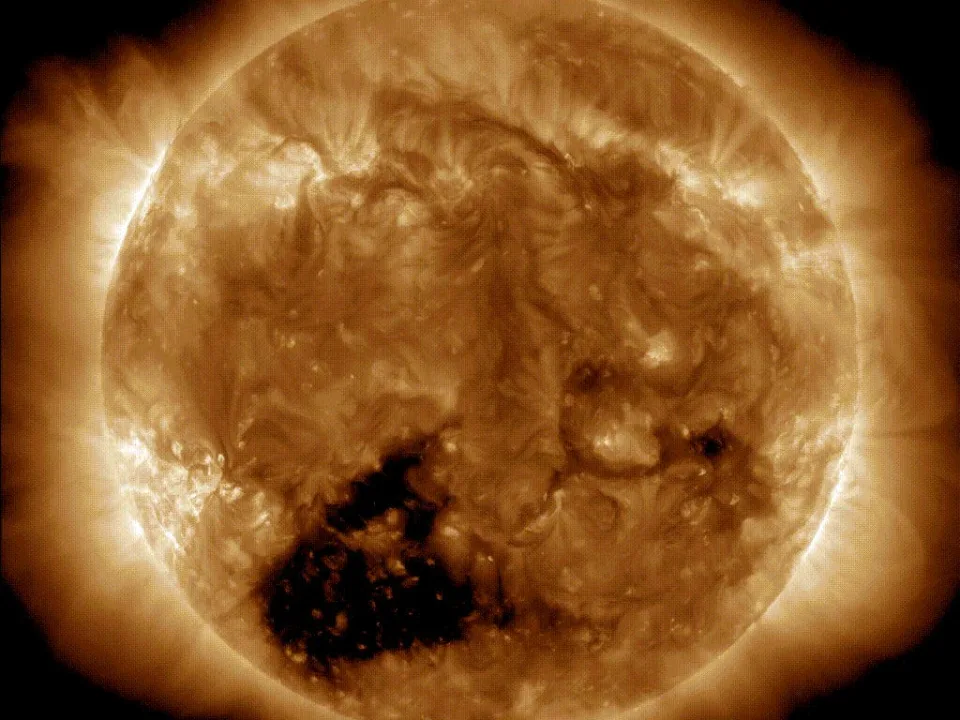

NASA's Solar Dynamics Observatory recently spotted a giant coronal hole on the surface of the sun that could fit 20-30 Earths across. Coronal holes are cooler regions on the sun's surface that appear black due to the lack of brightness. The current coronal hole is common and is the source of rapid solar winds that travel at speeds of about 500-800 km per second. These winds are expected to reach Earth by the end of this week, which will interact with Earth's magnetic field and create a more vibrant aurora borealis. While coronal holes are relatively harmless, the increasing solar activity could lead to more violent events like coronal mass ejections and solar flares that may cause electrical blackouts and disrupt communication technology. However, these events are infrequent, and scientists are excited about the increasing solar activity.

