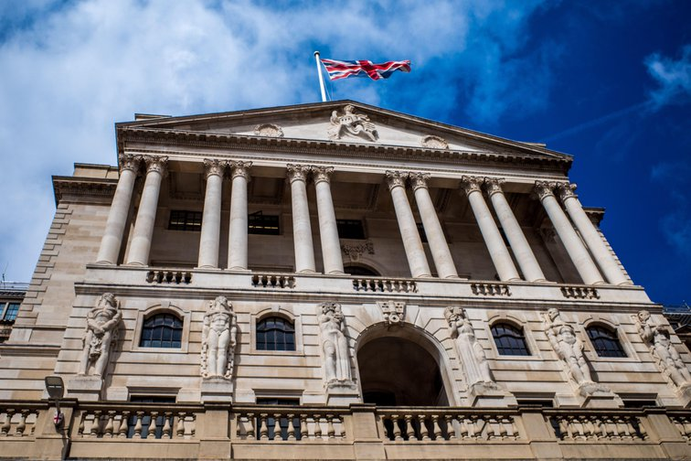

On Thursday, the Bank of England (BoE) announced its 11th consecutive interest rate hike, bringing Bank Rate to 4.25%. However, the central bank also said that it expects the recent spike in inflation to fade, which has led to speculation that the BoE may pause its tightening cycle. The move extends a run of increases that began in December 2021, but it was the Monetary Policy Committee's smallest increase since June. While investors have priced in one more quarter-point rate hike, many economists believe that the central bank may have already reached the end of its tightening cycle.

BoE Governor Andrew Bailey was non-committal when asked about the latest rate rise and said, "We don't know whether it's going to be the peak." He added, "What I can tell you is that we've seen signs of inflation really peaking now. But of course, it's far too high… We need to see it starting to come down progressively and get back to target."

The BoE is trying to balance the weak economic outlook and anxieties about global banks with stubborn inflation. The central bank repeated a message it gave last month that suggested raising rates was less urgent. "The MPC will continue to monitor closely indications of persistent inflationary pressures, including the tightness of labor market conditions and the behavior of wage growth and services inflation," the BoE said.

The BoE noted "large and volatile moves" in global financial markets but said its Financial Policy Committee judged that Britain's banking system was resilient. "The MPC will continue to monitor closely any effect on the credit conditions faced by households and businesses, and hence the impact on the macroeconomic and inflation outlook," it said.

