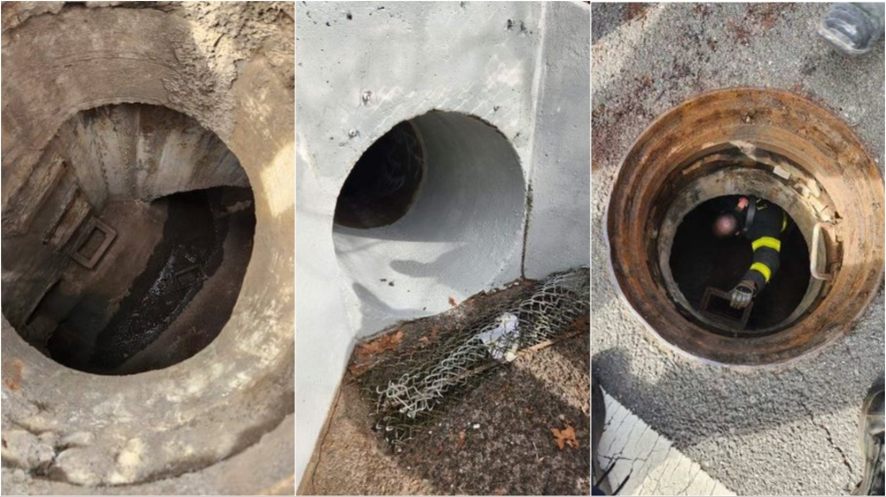

Five boys, aged 11 and 12, had to be rescued after they crawled through a storm drain tunnel on Staten Island, New York City and got lost, according to authorities. The boys called 911 when they couldn't find their way back after walking about a quarter mile. In audio released by the fire department, 911 dispatchers work to pinpoint the boys' exact location and then tell them to scream once rescuers are close enough to hear.

The dispatcher says, "Now you can scream as loud as you can. They want you to scream and yell." When sirens can be heard, the dispatcher tells the boys to scream. At first, the boys fear that the rescuers aren't stopping.

"It sounded like they went past us," one boy says. The dispatcher assures the boys, "They're not going anywhere, we're going to get you out of there."

Firefighters said the boys were in the tunnel for about an hour. The boys and one firefighter were taken to a hospital for evaluation, but none had significant injuries, officials said.

"Amazing that the cellphone worked in the tunnel," FDNY Chief of Department John Hodgens told reporters. "That was a key component of us finding them." The incident highlights the importance of staying away from storm drains and other dangerous areas, especially when there's a risk of getting lost or trapped.

