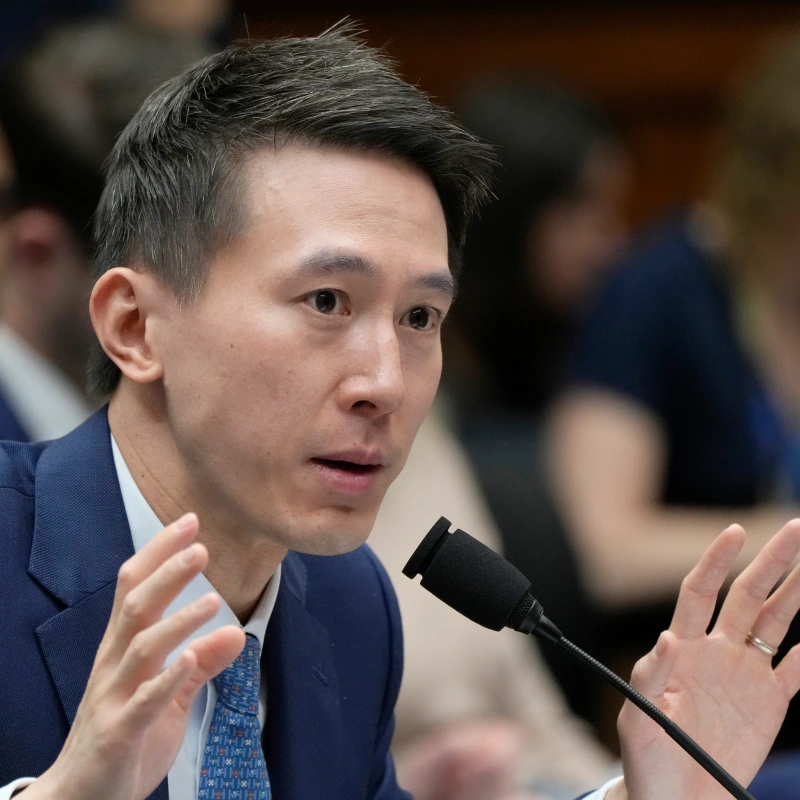

On Thursday, Shou Zi Chew, the CEO of TikTok, made a rare public appearance to address U.S. lawmakers’ concerns over data security and harmful content on the popular video-sharing app. Chew’s appearance comes at a crucial time for the company, which has 150 million American users and is facing increasing pressure from U.S. officials over its Chinese ownership. In a bipartisan effort to rein in the power of a major social media platform, Republican and Democratic lawmakers pressed Chew on a host of topics, including TikTok's content moderation practices, how the company plans to secure American data from Beijing, and its spying on journalists. TikTok has been dogged by claims that its Chinese ownership means user data could end up in the hands of the Chinese government or that it could be used to promote narratives favourable to the country's Communist leaders. In response, Chew reiterated the company's plan to protect U.S. user data by storing it on servers maintained and owned by software giant Oracle. The hearing was a "disaster" for TikTok, according to wealth management firm Wedbush, making a ban more likely if the social media platform doesn't separate from its Chinese parent.

