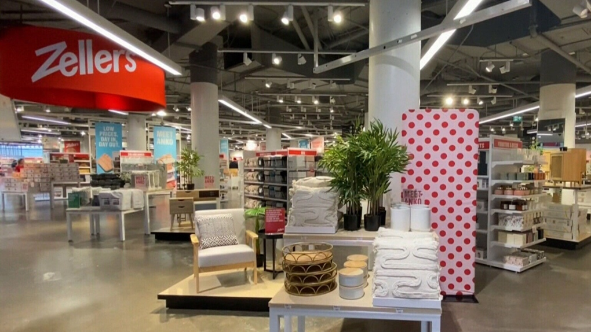

Zellers, a Canadian retail chain that has been closed for about a decade, recently reopened 25 stores across Ontario and Alberta, including select locations in the Greater Toronto Area. Crowds of nostalgic shoppers lined up outside the stores in the rain, eager to experience the chain's famous "everyday low prices" once again.

One of the select locations opening in the province is Scarborough Town Centre, where shoppers gathered before the store opened at 10 a.m. on Thursday. A DJ played "pump up" jams to get shoppers excited, and by 11:30 a.m., Zellers Diner on Wheels opened for Scarborough customers to grab a bite as they perused the big box store.

The reopening of Zellers has sparked a wave of nostalgia among Canadians who remember shopping at the chain in its heyday. The retailer was known for its affordable prices and wide selection of products, from clothing to electronics to home goods.

While Zellers has been closed for a decade, its parent company, Hudson's Bay, has been working on bringing it back. The relaunch includes not only the physical stores but also a new e-commerce platform.

Zellers' return is a sign of hope for brick-and-mortar retail, which has struggled in recent years due to the rise of e-commerce. The reopening of the chain shows that there is still a place for physical stores in the retail landscape, especially for those that offer affordable prices and a wide selection of products.

Overall, the reopening of Zellers has been met with enthusiasm from Canadians who are excited to see the return of a beloved retail chain. While the chain may face challenges in the highly competitive retail market, its reopening is a reminder of the enduring appeal of affordable, accessible shopping.

