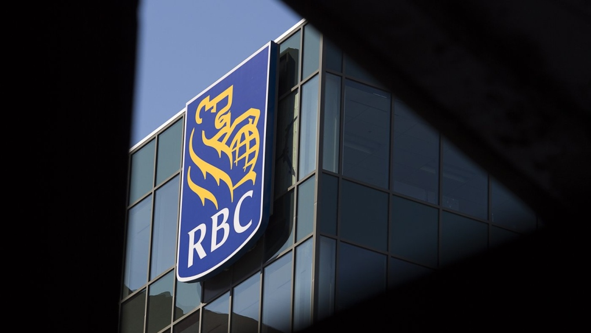

Royal Bank of Canada (RBC) has been identified as the largest fossil fuel funder in the world, according to the annual Banking on Climate Chaos report released by a coalition of environmental groups. In 2022, RBC provided over US$42 billion in funding, surpassing other major banks. While the bank had ranked fifth in fossil fuel financing between 2016 and 2021, last year marked the first time it was ranked as the top funder. TD and Scotiabank followed close behind, ranked at $29 billion and $29.5 billion, respectively. Bank of Montreal and CIBC were also identified as major fossil fuel financiers, ranking 15th and 16th with US$19.3 billion and US$17.9 billion in funding, respectively.

The report highlights the need for banks to phase out funding for fossil fuel projects, in line with global efforts to transition to a net-zero carbon economy. Environmental advocates have been pushing for more action to be taken in this regard, in order to make it harder for new oil and gas projects to be built and to accelerate the move away from fossil fuels.

Despite the report’s findings, RBC CEO Dave McKay defended the bank's funding and climate record at the recent annual shareholder meeting, emphasizing the importance of energy security and an orderly transition away from fossil fuel funding. Environmental groups, however, argue that the findings demonstrate the need for greater regulation to ensure that banks act in the best interests of the planet and future generations. As Greenpeace Canada senior energy strategist Keith Stewart noted, the report shows that bankers cannot be trusted to take the necessary action on climate change without regulation.

The report serves as a reminder of the urgent need for financial institutions to take strong action on climate change, particularly with regard to the financing of fossil fuel projects. With the global community increasingly focused on the transition to a net-zero carbon future, banks and other financial institutions will need to play a key role in enabling this transition, by financing renewable energy projects and supporting the development of new technologies to reduce emissions.

